# LabVIEW ORM - A User's Guide
## Basics
### Connecting to your Database
The SqlMapper class needs a database connection to function. To connect to a specific database type, you must supply a connection string and the type of database.

If you are unsure of the connection string, [connectionstrings.com](https://www.connectionstrings.com/) is a good resource.

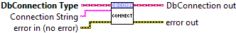

### Query First
Query First will return the first row of a query (and only the first row). This is useful when you only expect a single element back.

The type of the returned element is a variant with each column of the select statement being a variant attribute.

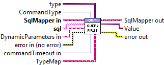

### Query
Query will return all rows associated with the given query, not just the first. By default, this returns a Query Result object that you will have to iterate over by calling Next.

If you wire a type to the Type input, it will return all rows as an array. Be careful, as this can consume a lot of memory.

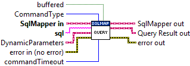

### Execute
Execute allows you to execute a SQL command and will tell you how many rows were affected.

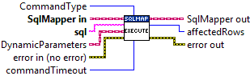

## CRUD
### Insert
Creates a new row in the database based on the TypeMap and object passed in.

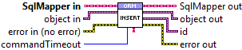

### Get
Reads the first row from the TypeMapped table that matches the Primary Keys of the object passed in.

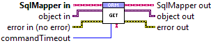

### Get All
Returns an iterator that will let you iterate over all of the objects related to the TypeMap.

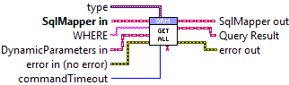

### Update
Updates the first row from the TypeMapped table that matches the Primary Keys of the object passed in.

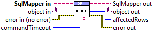

### Delete
Deletes the first row from the TypeMapped table that matches the Primary Keys of the object passed in.

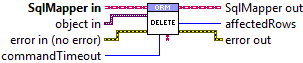

### Non-mapped Tables
If you have a simple table without a TypeMap class, you can still use the CRUD functionality by passing in the table name as the TypeMap and the database row as Variant Attributes.

## Advanced Palette
### Transactions
A transaction, in the context of a database, is a logical unit that is independently executed for data retrieval or updates. With this toolkit you can start a transaction with Begin Transaction and either commit or rollback with Commit Transaction and Rollback Transaction respectively.

All Begin Transactions MUST have a corresponding Commit or Rollback for every possible code path. The only exception is if your program completely crashes out, in which case the current transaction will be lost.

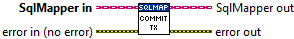
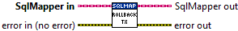

### Dynamic Parameters
Dynamic Parameters are useful when using user input in your query. Parameterizing all of your queries will protect you from SQL Injection attacks by automatically escaping any potential attacks that might slip through with a string-format query.

For convenience, you can pass Variant Attributes into any Dynamic Parameters terminal and they will be automatically converted but if you are using the same Parameters across many queries it will be more efficient to build them up once.

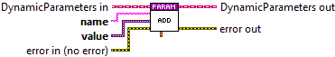
